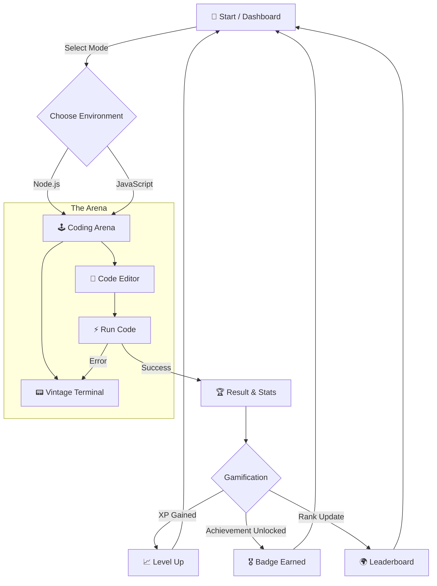

# 🚀 Retro Cyberpunk CP Arena

> **The ultimate competitive programming experience in a retro-futuristic arcade environment.**

  

Welcome to the **Retro Cyberpunk CP Arena**, a gamified coding platform that transforms standard algorithmic practice into an immersive 80s neon experience. Complete with synthesizers, scanlines, and high-stakes coding battles.

---

## 🔮 The Experience (User Flow)



---

## 📂 Project Structure

The project is organized as a monorepo-style structure with the main application residing in `next-arena`.

```
Retro-Cyberpunk-CP-Gaming-Arena/
├── 📄 CODE_OF_CONDUCT.md   # Community guidelines
├── 📄 CONTRIBUTING.md      # Contribution guide
├── 📄 LICENSE              # MIT License
├── 📄 README.md            # You are here
└── 📂 next-arena/          # Main Next.js Application
    ├── 📂 public/          # Static assets (images, fonts, sounds)
    ├── 📂 src/             # Source code
    │   ├── 📂 app/         # Next.js App Router & Pages
    │   ├── 📂 components/  # Reusable UI components (Arena, Terminal, etc.)
    │   └── 📂 context/     # Global state management
    ├── 📄 next.config.ts   # Next.js configuration
    ├── 📄 package.json     # Dependencies & Scripts
    └── 📄 tsconfig.json    # TypeScript configuration
```

---

## 🎮 Features

- **👾 Retro Aesthetic**: CRT monitor effects, neon glow, and pixel art UI.
- **🏆 Gamification**: Earn XP, level up, and unlock "achievements" like *Bug Hunter* or *Speed Demon*.
- **📊 Real-time Dashboard**: View your stats, streaks, and global ranking.
- **⚡ Omni-Terminal**: An integrated, vintage-style terminal for input/output.
- **🎧 Immersive Audio**: Synthwave background tracks and arcade SFX for actions.

---

## 🛠️ Tech Stack

- **Framework**: [Next.js 14+](https://nextjs.org/) (App Router)
- **Language**: TypeScript
- **Styling**: Tailwind CSS + Custom CSS (Animations, Glows)
- **Logic**: Node.js runtime environment simulation

---

## ⚡ Getting Started

Follow these steps to set up the arena locally.

### Prerequisites

- Node.js (v18 or higher)
- npm or yarn

### Installation

1.  **Clone the repository:**
    ```bash
    git clone https://github.com/akshaykumar33/Retro-Cyberpunk-CP-Gaming-Arena.git
    cd Retro-Cyberpunk-CP-Gaming-Arena
    ```

2.  **Navigate to the application directory:**
    ```bash
    cd next-arena
    ```

3.  **Install dependencies:**
    ```bash
    npm install
    # or
    yarn install
    ```

4.  **Run the development server:**
    ```bash
    npm run dev
    # or
    yarn dev
    ```

5.  Open [http://localhost:3000](http://localhost:3000) with your browser to enter the arena.

---

## 🤝 Contributing

We love contributions! Whether it's fixing a bug, adding a new retro theme, or optimizing the code runner.

Please read our [CONTRIBUTING.md](../CONTRIBUTING.md) for details on our code of conduct and the process for submitting pull requests.

---

## 📄 License

This project is licensed under the MIT License - see the [LICENSE](../LICENSE) file for details.

---

> *Built with 💜 and Neon by the CP Arena Team.*
